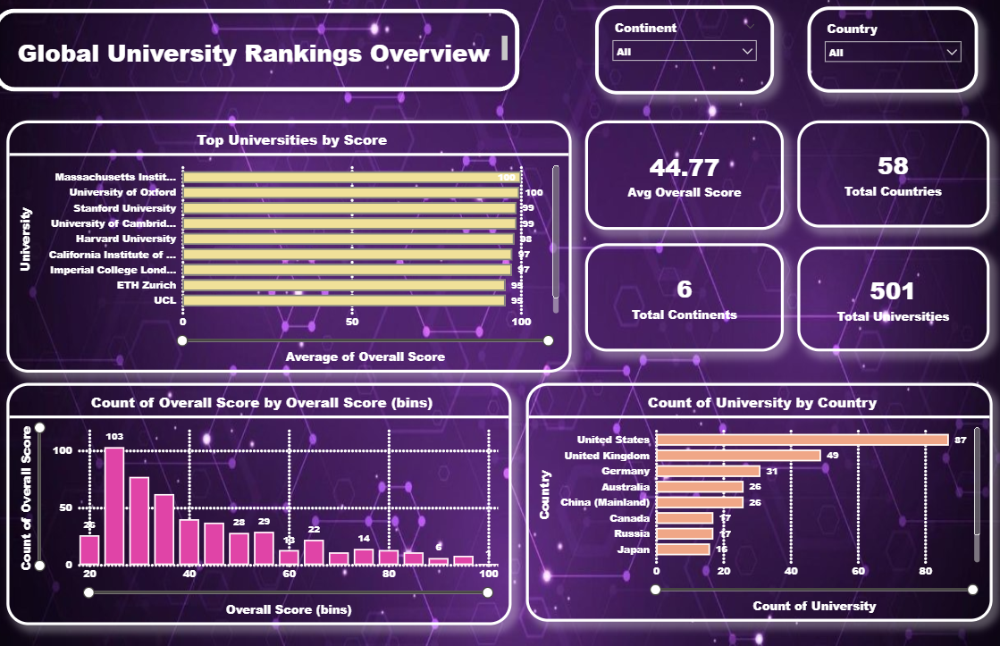

# 🎓 Global University Rankings Analysis

## 📌 Project Overview

This project focuses on analyzing global university rankings using data scraped from the QS World University Rankings website. The goal is to extract meaningful insights about university performance, geographical distribution, and ranking trends using Python (EDA), SQL, and Power BI.

---

## 🌐 Data Source

The dataset was scraped from:

**QS World University Rankings**
[https://www.topuniversities.com](https://www.topuniversities.com)

Data was accessed via the QS rankings API endpoint and processed for analysis.

---

## 🛠️ Tools & Technologies Used

* **Python** (Pandas, NumPy)
* **Data Visualization** (Matplotlib, Seaborn)
* **Web Scraping** (Requests, BeautifulSoup)
* **SQL (MySQL)**
* **Power BI**
* **Jupyter Notebook**

---

## 🔄 Project Workflow

### 1. Data Collection

* Data fetched using API from QS Rankings website
* Extracted fields: Rank, University, Country, Region, City, Overall Score

### 2. Data Cleaning

* Removed unwanted symbols from rank
* Converted columns to numeric format
* Handled missing values
* Removed duplicates
* Standardized text fields

### 3. Feature Engineering

* Created **Rank Category** (Top 10, Top 50, Top 100, Beyond 100)
* Created **Score Category** (Excellent, Good, Average)
* Added **Continent** column

### 4. Exploratory Data Analysis (EDA)

Key analysis performed:

* Distribution of overall scores
* Rank distribution
* Top countries by number of universities
* Rank vs Score relationship
* Score distribution by continent
* Correlation analysis

### 5. SQL Analysis

Performed advanced queries such as:

* Top 10 universities by score
* Country-wise university count
* Average score by continent
* Top universities per country (using window functions)
* Universities above global average

### 6. Power BI Dashboard

Created an interactive multi-page dashboard including:

* Global overview (KPIs, top universities, distribution)
* Geographical analysis (map, country & continent insights)
* Performance analysis (rank vs score, categories)
* Key insights & summary

---

## 📊 Dashboard Preview




---

## 🔑 Key Insights

* Top universities are concentrated in a few countries like the US and UK
* Higher-ranked universities tend to have significantly higher scores
* Europe and North America dominate university rankings
* Score distribution is skewed, with most universities falling into the average category

---

## 📁 Output Files

* `clean_university_data.csv`
* `qs_final_dataset.csv`
* Power BI Dashboard (.pbix)

---

## 🚀 How to Run

1. Clone the repository
2. Install required libraries:

   ```bash
   pip install pandas numpy matplotlib seaborn requests beautifulsoup4
   ```
3. Run the Python script for data extraction and cleaning
4. Import dataset into SQL for querying
5. Load dataset into Power BI for dashboard visualization

---

## 📌 Conclusion

This project demonstrates end-to-end data analysis including web scraping, data cleaning, EDA, SQL querying, and dashboard creation. It highlights the ability to transform raw data into actionable insights using modern data tools.

---

## 👩‍💻 Author

**Aditi Kodande**

---

## ⭐ If you like this project

Give it a star on GitHub ⭐
